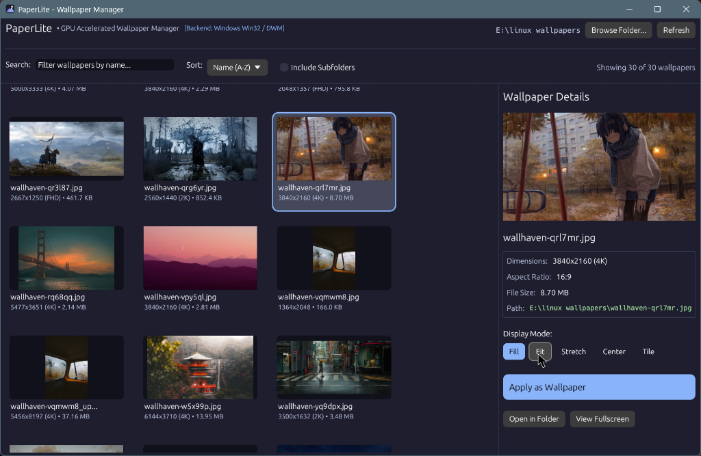

# 🌌 PaperLite

> **Ultra-lightweight, GPU-accelerated wallpaper browser & manager for Windows and Linux.**

PaperLite is built from the ground up in Rust using immediate-mode GPU rendering (`egui` + `glow` / `wgpu`). It has near-instant startup (< 0.05s), tiny memory consumption (~20-30MB RAM), and a standalone release binary of only ~5.8 MB.



---

## ✨ Features

- **⚡ Hardware / GPU Accelerated**: Renders directly via OpenGL / DirectX / Vulkan with 144Hz+ silky smooth scrolling.
- **🖼️ Non-blocking Multithreaded Thumbnails**: Background decoding threads stream image data straight into GPU VRAM textures without stuttering.
- **🐧 Linux Backend (`swaybg`)**:
  - Sets wallpapers using `swaybg -i <path> -m <mode>`.
  - Automatically terminates previous `swaybg` instances to prevent process buildup.
  - Automatically creates and updates `~/.config/swaybg/current_wallpaper.sh` for easy autostart in **Sway**, **Hyprland**, or **Wayfire**.
- **🪟 Windows Backend**:
  - Uses native Win32 `SystemParametersInfoW` (`SPI_SETDESKWALLPAPER`) and registry keys (`HKCU\Control Panel\Desktop`).
  - Supports all display styles: `Fill`, `Fit`, `Stretch`, `Center`, `Tile`.
  - Automatically transcodes unsupported formats (like modern `.webp` wallpapers) into cached high-res PNGs so any image applies reliably.
- **🔍 Search & Filter**:
  - Real-time filename filter.
  - Sorting by Name (A-Z, Z-A), Date Modified (Newest/Oldest), and File Size.
  - Optional recursive subfolder scanning.
- **🎨 Modern Dark Theme**: Elegant slate/indigo palette (Catppuccin Mocha aesthetic) with resolution badges (`4K`, `2K`, `FHD`, `Ultrawide`), aspect ratio detection, and file metadata.
- **🖥️ Dual Mode (GUI & CLI)**: Can be used interactively or headless via CLI commands / scripts.

---

## 🚀 Quick Start

### Windows
1. Double-click `run.bat` or run:
   ```cmd
   target\release\paperlite.exe
   ```

### Linux (Wayland / Sway / Hyprland)
1. Run the setup script (installs Rust & swaybg automatically):
   ```bash
   ./setup.sh
   ```
2. Launch PaperLite:
   ```bash
   ./run.sh
   ```

---

## ⌨️ Command Line Usage (CLI)

You can use PaperLite without opening the GUI to set wallpapers programmatically or in startup scripts:

```bash
# Set wallpaper with Fill mode (default):
paperlite --apply /path/to/wallpaper.jpg

# Set wallpaper with a specific mode (fill, fit, stretch, center, tile):
paperlite --apply /path/to/wallpaper.png --mode fit
paperlite --apply /path/to/wallpaper.png --mode center
```

### Sway / Hyprland Autostart Integration
PaperLite automatically writes the current wallpaper selection to `~/.config/swaybg/current_wallpaper.sh`.

- **Modern Hyprland (Lua)** (`~/.config/hypr/hyprland.lua`):
  ```lua
  hl.on("hyprland.start", function ()
    hl.exec_cmd("~/.config/swaybg/current_wallpaper.sh")
  end)
  ```
- **Classic Hyprland** (`~/.config/hypr/hyprland.conf`):
  ```ini
  exec-once = ~/.config/swaybg/current_wallpaper.sh
  ```
- **Sway** (`~/.config/sway/config`):
  ```sway
  exec_always ~/.config/swaybg/current_wallpaper.sh
  ```

---

## 🛠️ Building From Source

Make sure Rust is installed (`./setup.sh` handles this), then:

```bash
# Debug build (fast compile):
cargo build

# Optimized release build (small 5.8MB binary):
cargo build --release
```

---

## 📜 Architecture Overview

```
paperlite/
├── src/
│   ├── backend/
│   │   ├── mod.rs          # Cross-platform wallpaper mode definitions
│   │   ├── windows.rs      # Win32 SystemParametersInfoW + Registry
│   │   └── linux.rs        # swaybg process management & script generator
│   ├── config.rs           # JSON preferences (last folder, default mode)
│   ├── scanner.rs          # Directory walker & image metadata extraction
│   ├── ui/
│   │   ├── theme.rs        # GPU dark UI palette & styling
│   │   └── app.rs          # egui gallery grid & inspector panel
│   └── main.rs             # CLI parser & native window runner
├── run.bat                 # Windows 1-click launcher
├── run.sh                  # Linux launcher
├── setup.sh                # Linux one-time setup (installs Rust & swaybg)
└── Cargo.toml
```
